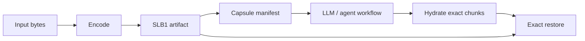

# Star Light Codec

AI ワークフローのための exact byte artifact。

言語: [English](README.md) | 日本語

Star Light Codec は、LLM や agent が実ファイルを扱うときに、ファイル本体、
圧縮済み payload、base64 blob をそのまま prompt に貼らずに済ませるための
codec / artifact 基盤です。byte 列を exact に復元できる artifact として保存し、
model には compact な manifest だけを渡し、必要なときだけ tool layer が exact
chunk を hydrate します。

これは media codec pack ではありません。video codec でもなく、Astro Starlight
とも関係ありません。

特に向いている用途:

- compact context と exact byte recovery の両方が必要な AI workflow
- 長時間続く coding / document session で、durable artifact を chat transcript の外に置きたい場面
- exactness を失わずに、保存すべきかどうかの判断材料が欲しい automation
- encoder を進化させても、古い decoder を複雑にしたくない codec 実験



## いまできること

- **Exact byte artifacts:** `SLB1` は transformed payload bytes、compact metadata、
  length check、SHA-256 digest を保存します。
- **LLM transport capsules:** artifact、chunk、summary、tag、digest、hydration
  affordance を記述する小さな JSON manifest です。raw bytes は埋め込みません。
- **地味で安全な decoder:** decode は allowlist ベースで deterministic、
  fail-closed です。encoder planner は exact restore contract を変えずに改善できます。
- **正直な storage advice:** random data や既に圧縮済みの data は、無理に圧縮成功扱いせず
  `keep-original-for-storage` として報告できます。
- **Experimental CDF profiles:** standalone CDF oracle 実験向けに public profile descriptor
  と resolver command を提供します。production `SLB1` compatibility は保守的に維持します。

重要なのは、最初の baseline encoder が gzip を使うことではありません。中心にあるのは
artifact contract です。decoder は source file type を知らなくても exact bytes を復元でき、
payload は transform 前後で検証でき、今後の encoder planner は baseline decode model を
変えずに compression ratio を競えます。

この repository は、読みやすい Python reference implementation から始めています。今後は
stronger encoder、chunking、dictionary、domain-specific codec、authenticated sealed artifact
などを追加できますが、初期 format を audit しにくくしないことを重視します。

## Quick Start

まず exact byte round trip を試します。

```powershell
python -m pip install -e .[test]
python -m starlight_codec encode README.md README.slb1 --max-passes 2
python -m starlight_codec inspect README.slb1
python -m starlight_codec decode README.slb1 README.roundtrip.md
```

agent に raw bytes や compressed bytes ではなく metadata を読ませたい場合は、
LLM transport layer を追加します。

```powershell
python -m starlight_codec capsule README.md README.slb1 README.capsule.json --tag docs
python -m starlight_codec capsule-pack README.pack.json README.capsule.json --summary "Docs pack"
python -m starlight_codec token-report README.capsule.json README.pack.json
python -m starlight_codec hydrate README.capsule.json README.chunk.md --chunk c0001
```

開発時は reference tests を実行します。

```powershell
pytest
```

encoder は artifact を書き出します。decoder は元の bytes を exact に復元します。
command output は metadata のみで、package payload は表示しません。

## なぜ重要か

- **Arbitrary bytes:** text、JSON、log、binary、generated artifact、未知の file type まで、
  同じ exact-byte interface で扱えます。
- **Exactness は仮定せず検証する:** `SLB1` は original byte length、transformed payload length、
  payload digest、final input digest を保存します。
- **Decoder は意図的に地味:** header を読み、artifact を検証し、allowlist された transform を
  逆順に適用し、復元 bytes を検証します。
- **Encoder evolution と decode safety を分離:** より良い planner は chunk、dictionary、
  residual、将来の domain-specific strategy を選べますが、exact compatibility contract は維持します。
- **Compression adoption が正直:** metadata は artifact 全体が source より小さいかを報告します。
  小さくない場合、caller は original を保持できます。

## Technical Shape

`SLB1` は self-contained な exact-byte artifact です。

現在の `SLB1` artifact:

```text
magic          4 bytes   ASCII "SLB1"
headerLength   4 bytes   little-endian uint32
payloadLength  8 bytes   little-endian uint64
header         N bytes   UTF-8 compact JSON
payload        M bytes   raw transformed payload bytes
```

header は compatibility profile を記録します。

- `schemaVersion: 2`
- `packageKind: starlight-byte-exact`
- `artifactContainer: slb1`
- `packageFormat: layered`
- `strategy: stored-base64 | gzip-base64 | gzip-recursive-base64 | delta-prev-*`
- `transforms: [] | ["gzip"] | ["delta-prev-v1", "gzip", ...]`
- `inputDigest` と `payloadDigest` は `sha256:<64 hex>`

payload は JSON に埋め込みません。header の後ろに raw bytes として保存するため、metadata を
inspectable に保ちながら base64 expansion を避けます。

正確な format contract は [docs/spec.md](docs/spec.md) を参照してください。

## これは何ではないか

- gzip、zstd、Brotli、PNG、MP3、Opus などの成熟した codec の置き換えではありません。
- universal compression を主張するものではありません。
- neural machine-learning compressor ではありません。
- production security system ではありません。
- media file 再生用の codec pack ではありません。

現在の encoder は、主に container contract と exact validation flow を示すためのものです。
redundant data では小さくなることがあります。random data や既に圧縮済みの data では、
`keep-original-for-storage` を報告するべきです。

## Current Encoder

reference encoder は bounded transform planner を使います。

1. input shape を分類する
2. 最大 4 回まで gzip pass を試す
3. pass が payload size を減らさなくなったら止める
4. `stored-base64`、`gzip-base64`、`gzip-recursive-base64` の strategy metadata を書く
5. artifact 全体の size と source を比較する
6. full artifact が source より小さい場合だけ `use-artifact-for-storage` を報告する

これは baseline であり、上限ではありません。roadmap では、exact round-trip と fail-closed
decode behavior を invariant としたまま、encoder を賢くしていきます。

## Stronger Planner

compatibility default は `--planner gzip` のままですが、standard-library planner を opt-in できます。

```powershell
python -m starlight_codec encode input.bin input.slb1 --planner stdlib-auto --model auto
```

`stdlib-auto` は `gzip`、`zlib`、`bz2`、`lzma` で作った complete `SLB1` artifact を比較し、
artifact 全体が最小のものを採用します。payload だけの勝ちが metadata overhead で消えることが
あるため、whole artifact で比べます。decode は allowlisted かつ exact のままです。

## Experimental Model Layer

Star Light Codec は、compression 前に小さな deterministic prediction model を試すこともできます。

```powershell
python -m starlight_codec encode input.bin input.slb1 --model auto
python -m starlight_codec capsule input.bin input.slb1 input.capsule.json --model auto
```

最初の model は `delta-prev-v1` です。各 byte を直前の byte から予測し、byte-wise residual を
保存してから、選択された compression planner で residual を圧縮します。これは neural compressor
ではなく、lossy でもありません。model id、model hash、transform stack、payload digest、
final input digest をすべて保存するため、decode は exact かつ fail-closed です。

`--model auto` は baseline encoder と modeled encoder を比較し、whole `SLB1` artifact が小さい場合だけ
modeled artifact を採用します。現在の strongest reference path としては `--planner stdlib-auto` と
組み合わせられます。baseline `SLB1` contract との最大互換性のため、default は `--model none` です。

## LLM Transport Capsules

LLM に gzip、base64、compressed payload bytes を直接理解させようとしないでください。
compressed bytes は opaque なものとして扱います。

Star Light Codec には、LLM-facing transport layer が含まれています。

```powershell
python -m starlight_codec capsule input.bin input.slb1 input.capsule.json `
  --summary "Asset metadata fixture" `
  --tag exact-roundtrip

python -m starlight_codec hydrate input.capsule.json chunk.bin --chunk c0001
python -m starlight_codec hydrate input.slb1 range.bin --range 0:4096
```

capsule は model 向けの compact JSON manifest です。artifact reference、digest、size、
strategy、semantic tag、summary、chunk index を含みます。raw bytes や base64 payload は
埋め込みません。hydration は tool layer が行うため、model は metadata で reasoning し、
必要なときだけ exact bytes を要求できます。

詳細は [docs/llm-transport.md](docs/llm-transport.md) を参照してください。

### Capsule Packs And Token Reports

byte compression と prompt-token reduction は関連しますが、別の仕事です。`SLB1` は transformed
bytes を artifact に保持することで storage と exact hydration を助けます。capsule と capsule pack は、
compact metadata、reference、summary、tag、digest、size、hydration affordance だけを LLM に渡すことで
prompt を助けます。raw bytes、transformed payload bytes、base64 は意図的に埋め込みません。

`capsule-pack` は、1 つ以上の capsule document をまとめたり、別の pack を再帰的に参照したりするために使います。

```powershell
python -m starlight_codec capsule-pack project.pack.json `
  README.capsule.json docs.capsule.json `
  --summary "Documentation capsules"

python -m starlight_codec capsule-pack workspace.pack.json project.pack.json
```

`token-report` は prompt cost の粗い比較に使います。UTF-8 text として読める場合の raw text tokens、
base64-ish raw byte prompt tokens、compact capsule / pack prompt tokens、estimated savings を報告します。

```powershell
python -m starlight_codec token-report README.md README.capsule.json project.pack.json
```

この estimate は意図的に approximate で、tokenizer-independent です。compression ratio の benchmark ではなく、
model が recursive capsule を読み、必要なときだけ exact bytes の hydration を要求すべき場面を判断するためのものです。

## Example Metadata

```json
{
  "schemaVersion": 2,
  "codec": "starlight-byte-exact",
  "container": "slb1",
  "strategy": "gzip-recursive-base64",
  "rawBytes": 49152,
  "payloadBytes": 113,
  "artifactBytes": 920,
  "recommendedForStorage": true,
  "adoptionDecision": "use-artifact-for-storage"
}
```

## Roadmap

roadmap は [docs/roadmap.md](docs/roadmap.md) にあります。次の planned tracks は smarter encoder planning、
physical chunked containers、dictionaries、domain-specific residual codecs、separate authenticated
sealing layer です。

## Benchmarks

synthetic local benchmark results は [BENCHMARKS.md](BENCHMARKS.md) にあります。現在の baseline は
raw bytes、gzip、gzip+base64、`SLB1`、`--model auto`、LLM-facing capsule manifests を、redundant text、
JSON logs、ramp bytes、random bytes、already-compressed input で比較します。

local file では real-data harness を使います。

```powershell
python benchmarks\benchmark_real_data.py README.md src tests --label-root .
```

これは baseline `SLB1`、gzip-model `SLB1`、strong `SLB1`
(`--planner stdlib-auto --model auto`) を、local Python environment で利用できる standard compressor と
比較します。default で exact decode を検証し、report に raw file contents を埋め込みません。

automatic predictor exploration には bounded search harness を使います。

```powershell
python benchmarks\search_predictors.py README.md src tests `
  --label-root . `
  --search-mode adaptive `
  --time-limit-seconds 30 `
  --state-input benchmarks\results\predictor-state.json `
  --state-output benchmarks\results\predictor-state.json
```

search harness は run 内で学習し、有望な deterministic predictor candidate を優先し、exact round-trip を
検証し、設定された time / candidate / file limit で停止します。`--state-input` と `--state-output` により、
small controller は raw file contents を保存せず、aggregate rewards を run 間で持ち越せます。

有望な candidate が見つかった後は、`--candidate-filter` で focused experiment をすばやく実行できます。

```powershell
python benchmarks\search_predictors.py README.md src tests `
  --label-root . `
  --search-mode exhaustive `
  --time-limit-seconds 30 `
  --candidate-limit 64 `
  --candidate-filter segmented-stream-oracle-4096+zlib
```

## Name Check

project name は **Star Light Codec** です。簡単な public search では、`StarCodec`、`Stable Codec`、
多数の `Starlight` documentation / camera-related project など近い名前は見つかりましたが、
`Star Light Codec` という exact public project は明確には見つかりませんでした。
これは legal advice ではありません。README と package description は、media-codec-pack behavior を
主張しないようにしています。

## Licensing

この repository は Star Light と同じ policy に従います。

- Reference implementation code、CLI、tests、benchmark scripts: Apache-2.0.
- Codec format、compatibility profile、schemas、transport capsule spec、test vectors、
  fixtures、sample metadata、benchmark result data: CC0-1.0.
- Narrative docs、README files、roadmap text: CC BY 4.0 unless marked otherwise.

詳細は [LICENSING.md](LICENSING.md) を参照してください。
