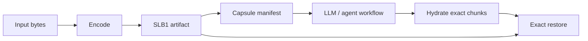

# Star Light Codec

Exact byte artifacts for AI workflows.

Star Light Codec is for tools that need an LLM or agent to work with real
files without pasting those files, compressed payloads, or base64 blobs into the
prompt. It packages bytes into exact artifacts, gives the model compact
manifests to reason over, and lets the tool layer hydrate exact chunks only when
they are needed.

This is not a media codec pack, not a video codec, and not related to Astro
Starlight.

It is especially useful for:

- AI workflows that need compact context plus exact byte recovery;
- long-running coding or document sessions that should keep durable artifacts
  outside the chat transcript;
- automation that wants storage advice without silently losing exactness;
- codec experiments where encoders can improve without making old decoders
  complicated.



## What You Get Today

- **Exact byte artifacts:** `SLB1` stores transformed payload bytes plus compact
  metadata, length checks, and SHA-256 digests.
- **LLM transport capsules:** small JSON manifests that describe artifacts,
  chunks, summaries, tags, digests, and hydration affordances without embedding
  raw bytes.
- **Boring decoders:** decode stays allowlisted, deterministic, and
  fail-closed. Encoder planners can improve without changing the exact restore
  contract.
- **Honest storage advice:** random or already-compressed data can be reported
  as `keep-original-for-storage` instead of pretending every output is worth
  storing.
- **Experimental CDF profiles:** public profile descriptors and resolver
  commands are available for standalone CDF oracle experiments, while production
  `SLB1` compatibility remains conservative.

The important part is not that the first baseline encoder uses gzip. The
important part is the artifact contract: a decoder can restore exact bytes
without knowing the source file type, the payload can be validated before and
after transforms, and new encoder planners can compete on compression ratio
without changing the baseline decode model.

This repository starts with a readable Python reference implementation. Future
work can add stronger encoders, chunking, dictionaries, domain-specific codecs,
and authenticated sealed artifacts without making the initial format harder to
audit.

## Quick Start

```powershell
python -m pip install -e .[test]
python -m starlight_codec encode README.md README.slb1 --max-passes 2
python -m starlight_codec inspect README.slb1
python -m starlight_codec decode README.slb1 README.roundtrip.md
python -m starlight_codec capsule README.md README.slb1 README.capsule.json --tag docs
python -m starlight_codec capsule-pack README.pack.json README.capsule.json --summary "Docs pack"
python -m starlight_codec token-report README.capsule.json README.pack.json
python -m starlight_codec hydrate README.capsule.json README.chunk.md --chunk c0001
pytest
```

The encoder writes an artifact. The decoder reconstructs the exact original
bytes. The command output is metadata only; it does not print the package
payload.

## Why This Is Strong

- **Arbitrary bytes:** text, JSON, logs, binaries, generated artifacts, and
  unknown file types all use the same exact-byte interface.
- **Exactness is checked, not assumed:** `SLB1` stores the original byte length,
  transformed payload length, payload digest, and final input digest.
- **The decoder is intentionally boring:** it reads the header, verifies the
  artifact, applies allowlisted transforms in reverse order, and verifies the
  reconstructed bytes.
- **Encoder evolution is separated from decode safety:** better planners can
  choose chunks, dictionaries, residuals, or future domain-specific strategies
  while preserving an exact compatibility contract.
- **Compression adoption is honest:** metadata reports whether the whole
  artifact is smaller than the source. If not, callers can keep the original.

## Technical Shape

`SLB1` is a self-contained exact-byte artifact:

The current `SLB1` artifact is:

```text
magic          4 bytes   ASCII "SLB1"
headerLength   4 bytes   little-endian uint32
payloadLength  8 bytes   little-endian uint64
header         N bytes   UTF-8 compact JSON
payload        M bytes   raw transformed payload bytes
```

The header records the compatibility profile:

- `schemaVersion: 2`
- `packageKind: starlight-byte-exact`
- `artifactContainer: slb1`
- `packageFormat: layered`
- `strategy: stored-base64 | gzip-base64 | gzip-recursive-base64 | delta-prev-*`
- `transforms: [] | ["gzip"] | ["delta-prev-v1", "gzip", ...]`
- `inputDigest` and `payloadDigest` as `sha256:<64 hex>`

The payload is not embedded in JSON. It is stored as raw bytes after the header,
so the container avoids base64 expansion while keeping the metadata inspectable.

See [docs/spec.md](docs/spec.md) for the exact format contract.

## What This Is Not

- Not a replacement for gzip, zstd, Brotli, PNG, MP3, Opus, or other mature
  codecs.
- Not a claim of universal compression.
- Not a neural machine-learning compressor.
- Not a production security system.
- Not a codec pack for playing media files.

The current encoder mostly demonstrates the container contract and exact
validation flow. On redundant data it can be small; on random or already
compressed data it should report `keep-original-for-storage`.

## Current Encoder

The reference encoder uses a bounded transform planner:

1. classify the input shape;
2. try up to four gzip passes;
3. stop when a pass does not reduce payload size;
4. write `stored-base64`, `gzip-base64`, or `gzip-recursive-base64` strategy
   metadata;
5. compare whole artifact size against the source;
6. report `use-artifact-for-storage` only when the full artifact is smaller.

This is a baseline, not the ceiling. The roadmap is to make the encoder smarter
while keeping exact round-trip and fail-closed decode behavior as the invariant.

## Stronger Planner

The compatibility default is still `--planner gzip`, but you can opt into a
stronger standard-library planner:

```powershell
python -m starlight_codec encode input.bin input.slb1 --planner stdlib-auto --model auto
```

`stdlib-auto` compares complete `SLB1` artifacts produced with `gzip`, `zlib`,
`bz2`, and `lzma`, then keeps the smallest whole artifact. This matters because
payload-only wins can disappear after metadata overhead. Decode remains
allowlisted and exact.

## Experimental Model Layer

Star Light Codec can also try a small deterministic prediction model before
compression:

```powershell
python -m starlight_codec encode input.bin input.slb1 --model auto
python -m starlight_codec capsule input.bin input.slb1 input.capsule.json --model auto
```

The first model is `delta-prev-v1`. It predicts each byte from the previous
byte, stores the byte-wise residual, then lets the selected compression planner
compress that residual. This is not a neural compressor and it is not lossy:
the model id, model hash, transform stack, payload digest, and final input
digest are all stored so decode remains exact and fail-closed.

`--model auto` compares the baseline encoder with the modeled encoder and keeps
the modeled artifact only when the whole `SLB1` artifact is smaller. Combine it
with `--planner stdlib-auto` for the current strongest reference path. The
default is still `--model none` for maximum compatibility with the baseline
`SLB1` contract.

## LLM Transport Capsules

Do not ask an LLM to understand gzip, base64, or compressed payload bytes
directly. Treat compressed bytes as opaque.

Star Light Codec now includes an LLM-facing transport layer:

```powershell
python -m starlight_codec capsule input.bin input.slb1 input.capsule.json `
  --summary "Asset metadata fixture" `
  --tag exact-roundtrip

python -m starlight_codec hydrate input.capsule.json chunk.bin --chunk c0001
python -m starlight_codec hydrate input.slb1 range.bin --range 0:4096
```

The capsule is a compact JSON manifest for the model: artifact reference,
digests, sizes, strategy, semantic tags, summary, and chunk index. It does not
embed raw bytes or base64 payloads. Hydration is performed by the tool layer so
the model can reason over metadata and request exact bytes only when needed.

See [docs/llm-transport.md](docs/llm-transport.md).

### Capsule Packs And Token Reports

Byte compression and prompt-token reduction are related but different jobs.
`SLB1` helps storage and exact hydration by keeping transformed bytes in an
artifact. Capsules and capsule packs help prompts by giving the LLM only compact
metadata, references, summaries, tags, digests, sizes, and hydration affordances.
They intentionally do not embed raw bytes, transformed payload bytes, or base64.

Use `capsule-pack` to group one or more capsule documents, or to recursively
reference another pack:

```powershell
python -m starlight_codec capsule-pack project.pack.json `
  README.capsule.json docs.capsule.json `
  --summary "Documentation capsules"

python -m starlight_codec capsule-pack workspace.pack.json project.pack.json
```

Use `token-report` for a rough prompt-cost comparison. It reports raw text
tokens when UTF-8 text can be read, base64-ish raw byte prompt tokens, compact
capsule or pack prompt tokens, and estimated savings:

```powershell
python -m starlight_codec token-report README.md README.capsule.json project.pack.json
```

The estimate is deliberately approximate and tokenizer-independent. It is meant
to show when the model should reason over recursive capsules and request
hydration for exact bytes only when needed, not to benchmark compression ratio.

## Example Metadata

```json
{
  "schemaVersion": 2,
  "codec": "starlight-byte-exact",
  "container": "slb1",
  "strategy": "gzip-recursive-base64",
  "rawBytes": 49152,
  "payloadBytes": 113,
  "artifactBytes": 920,
  "recommendedForStorage": true,
  "adoptionDecision": "use-artifact-for-storage"
}
```

## Roadmap

The roadmap is in [docs/roadmap.md](docs/roadmap.md). The next planned tracks
are smarter encoder planning, physical chunked containers, dictionaries,
domain-specific residual codecs, and a separate authenticated sealing layer.

## Benchmarks

Synthetic local benchmark results are in [BENCHMARKS.md](BENCHMARKS.md).
The current baseline compares raw bytes, gzip, gzip+base64, `SLB1`,
`--model auto`, and LLM-facing capsule manifests across redundant text, JSON
logs, ramp bytes, random bytes, and already-compressed input.

For local files, use the real-data harness:

```powershell
python benchmarks\benchmark_real_data.py README.md src tests --label-root .
```

It compares baseline `SLB1`, gzip-model `SLB1`, and strong `SLB1`
(`--planner stdlib-auto --model auto`) against standard compressors available
in the local Python environment. It verifies exact decode by default and avoids
embedding raw file contents in the report.

For automatic predictor exploration, use the bounded search harness:

```powershell
python benchmarks\search_predictors.py README.md src tests `
  --label-root . `
  --search-mode adaptive `
  --time-limit-seconds 30 `
  --state-input benchmarks\results\predictor-state.json `
  --state-output benchmarks\results\predictor-state.json
```

The search harness learns within the run, prioritizes promising deterministic
predictor candidates, verifies exact round-trip, and stops at the configured
time/candidate/file limits. `--state-input` and `--state-output` let the small
controller carry aggregate rewards across runs without storing raw file
contents.

After a promising candidate appears, run a fast focused experiment with
`--candidate-filter`:

```powershell
python benchmarks\search_predictors.py README.md src tests `
  --label-root . `
  --search-mode exhaustive `
  --time-limit-seconds 30 `
  --candidate-limit 64 `
  --candidate-filter segmented-stream-oracle-4096+zlib
```

## Name Check

The project name is **Star Light Codec**. A quick public search found nearby
names such as `StarCodec`, `Stable Codec`, and many `Starlight` documentation or
camera-related projects, but no obvious exact public project named
`Star Light Codec`.
This is not legal advice. The README and package description intentionally avoid
claiming media-codec-pack behavior.

## Licensing

This repository follows the same policy as Star Light:

- Reference implementation code, CLI, tests, and benchmark scripts: Apache-2.0.
- Codec format, compatibility profile, schemas, transport capsule spec, test
  vectors, fixtures, sample metadata, and benchmark result data: CC0-1.0.
- Narrative docs, README files, and roadmap text: CC BY 4.0 unless marked
  otherwise.

See [LICENSING.md](LICENSING.md).
